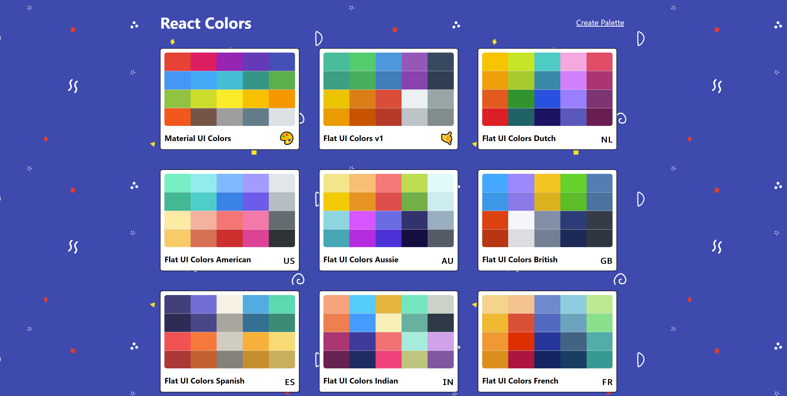

# React Colors

- An application that was designed to show off my knowledge of React.
- Built with a mobile-responsive design.
- A clone of the Material UI Colors website.

---

---

##### App Description

- The user is first brought to the home page where they are able to view different color palettes.
- Clicking on one of the color palettes allows the user to view the individual colors in the selected palette.
- When viewing a single palette, the user can view different shades of each color using the slider bar.
- By clicking on an individual color, the user can copy the color's HEX, RGB, or RGBA to their clipboard.
- The user has the capability to create their own custom color palettes.

---

##### Author

Keaton Sentak - [Portfolio](https://keatonsentak.com) | [GitHub](https://github.com/ksentak)
